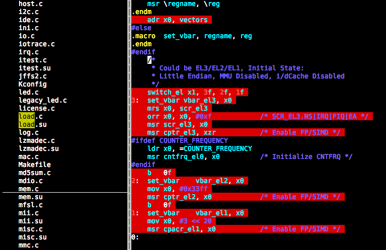

# highlight.vim

This vim plugin loads the match patterns from a file which is a serialized
dictionary with the file name as key and pattern as value. When a buffer is
loaded, the plugin will search the dictionary and find the pattern and set the
pattern using `matchadd` vim function, which add the pattern to a highlight
group "highlight_active_lines".

# How to use

## HighlightAdd <filename>

Use this command to add the file to the database.

The content of the files is like this:

```
{'test.vim': '\%1l\|\%3l\|\%5l', 'test2.vim': '\%1l\|\%2l\|\%3l'}
```

The pattern format like `\%1l\|\%3l\|\%5l`  means match line 1 or line 3 or line
5, where '\' is the escape character for `%` and `|`.  using `:help pattern` to
find the more details.

Theoretically you may add any patterns to the key values and vim will
highlight it for you.

The original idea to create such a plugin is to highlight the active c code
which is used in actually in compilation to generate machine code. I may create
a tool to convert the elf file to the database which could be loaded using
`HighlightAdd` function.

## HighlightReset

Use this command reset the dictionary database to empty.

## Customize the highlight color

Currently the highlight color is hard coded, you could customize the color using
a command similar with below command:

```
:highlight highlight_active_lines ctermbg=darkred guibg=darkred
```

## Todo

This is a very preliminary implementation. We may add function to invert the
match and low light the content which is not in the dictionary.
